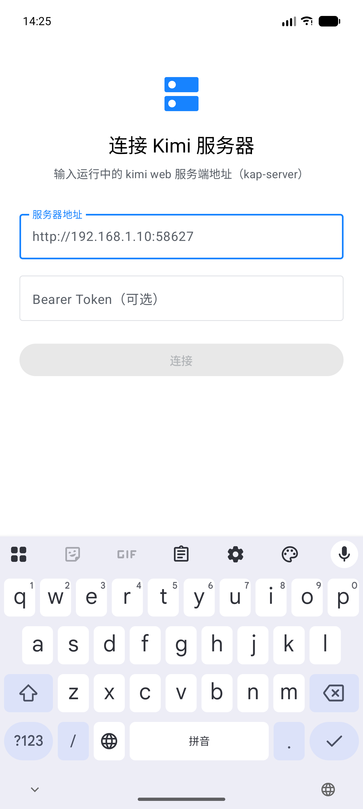
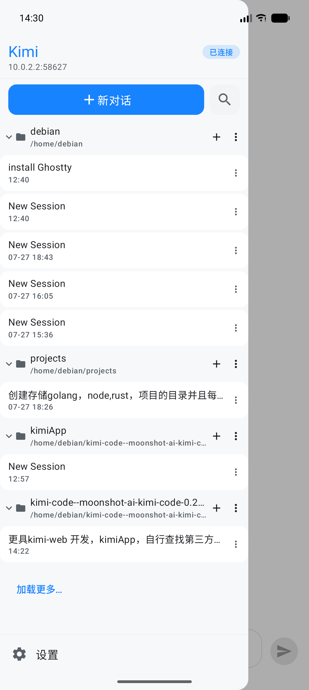
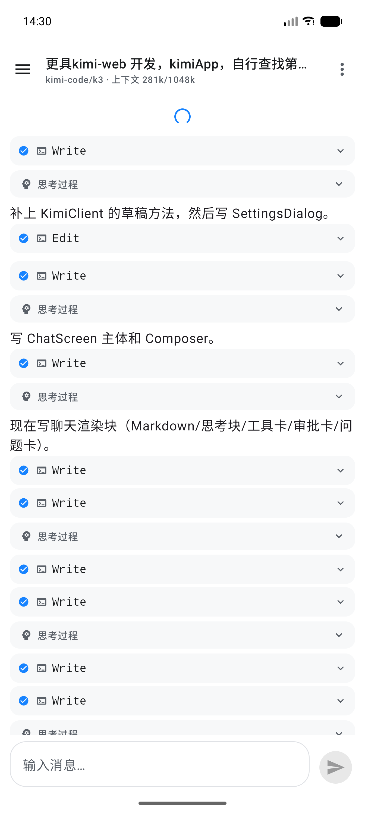
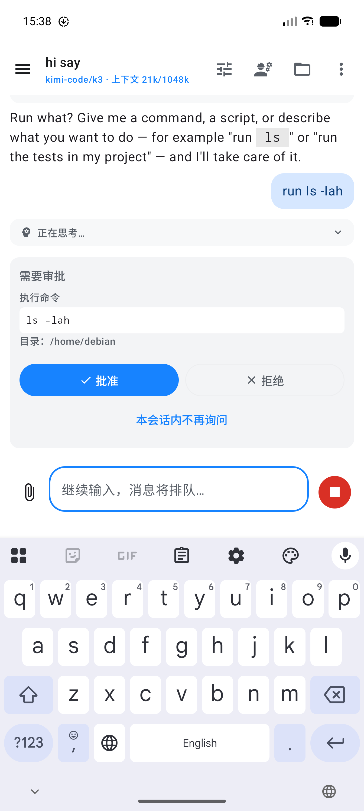

# kimi code — Android 客户端

[Kimi Code](https://github.com/MoonshotAI/kimi-code) 的 Android 客户端：连接运行中的 `kimi web` 服务端（kap-server），在手机上使用完整的 AI 编程助手能力。

> 本项目全程使用 **Kimi 3（K3）模型**辅助开发 —— 从协议分析、架构设计、代码编写到真机联调与问题修复，均由 AI 驱动的开发流程完成。

## 特色

- **完整聊天体验**：流式渲染、Markdown 富文本（代码高亮/表格/列表）、可折叠的思考过程块
- **工具调用可视化**：每个工具调用一张卡片（Bash / Read / Edit / Write / Agent …），参数与输出可展开查看
- **审批与交互**：工具执行审批（命令/diff/文件/URL 等全部类型）、单选/多选/自由输入的问题卡片，全部在手机上直接处理
- **会话管理**：工作区分组、活动徽章（运行中/待审批/待回答）、搜索、归档/恢复、重命名、Fork、导出、撤销回合、压缩历史
- **模型与模式**：模型选择器（收藏置顶）、思考级别切换、计划模式、权限模式（手动审批/自动批准/完全放行）
- **生产力细节**：
  - `/` 命令菜单（new/plan/thinking/compact/undo/fork/export/rename/skill…）
  - `@` 文件提及（模糊搜索服务端工作区文件）
  - 图片/文件附件上传与渲染
  - 多服务器配置切换，Bearer Token 认证，401 自动弹窗重输
  - 贴底自动跟随新消息，离开后"新消息 ↓"快捷回到底部
  - 草稿按会话持久化、输入排队、后台任务面板、文件树/Git 变更/Diff 视图
  - 回合完成/待审批的本地通知（应用退到后台时）
- **协议忠实移植**：WS 事件流（hello/subscribe/心跳/退避重连/resync）、快照同步、volatile delta 偏移对齐、内容签名去重，与 kimi-web 行为一致

## 技术栈

- **Kotlin 2.4 + Jetpack Compose + Material 3**（全部 UI 声明式，仅中文界面）
- **Retrofit / OkHttp**（REST + WebSocket）、**kotlinx.serialization**
- **multiplatform-markdown-renderer**（Markdown）、**Coil**（图片，带认证头）
- **DataStore Preferences**（多服务器配置、草稿、收藏）
- 无 DI 框架、无导航库：手动装配 + 状态驱动条件渲染（与 kimi-web 的 SPA 结构一致）

## 架构

```
app/src/main/java/com/kimi/app/
├── core/            SettingsStore(DataStore)、工具、通知
├── data/
│   ├── wire/        全部 wire DTO（与服务端协议一一对应）
│   ├── api/         Retrofit 接口、信封解包、错误处理、文件传输
│   ├── ws/          WebSocket 状态机（握手/订阅/心跳/重连/事件分类）
│   └── store/       AppState、EventReducer、AgentProjector、TurnGrouper、KimiClient
└── ui/              Compose 界面（连接页/抽屉/聊天/面板/设置）
```

关键实现对应 kimi-web（`apps/kimi-web/src/api/daemon/`）：

- `KimiSocket` ≈ `ws.ts`（classifyFrame 二段事件分类）
- `EventReducer` ≈ `eventReducer.ts`
- `AgentProjector` ≈ `agentEventProjector.ts`（流式增量 offset 对齐）
- `TurnGrouper` ≈ `messagesToTurns.ts`（回合合并/边界/去重/审批块）

## 构建

```bash
# 需要 JDK 17+ 与 Android SDK（compileSdk 37 / minSdk 31）
export JAVA_HOME=/path/to/jdk
./gradlew :app:assembleDebug      # 调试包
./gradlew :app:testDebugUnitTest  # 单元测试
./gradlew :app:assembleRelease    # 正式包（签名，不混淆）
```

正式签名：`keystore/keystore.properties`（不入库）指向 release 密钥。

## 连接服务端

1. 电脑上运行 `kimi web --host`（监听 0.0.0.0），记下输出的 Bearer Token
2. App 首次启动输入服务器地址（如 `http://192.168.1.10:58627`）与 Token
3. 模拟器联本机时地址用 `http://10.0.2.2:58627`

## 截图

| 连接 | 会话列表 | 聊天 | 审批 |
|------|----------|------|------|
|  |  |  |  |

## 许可证

MIT
